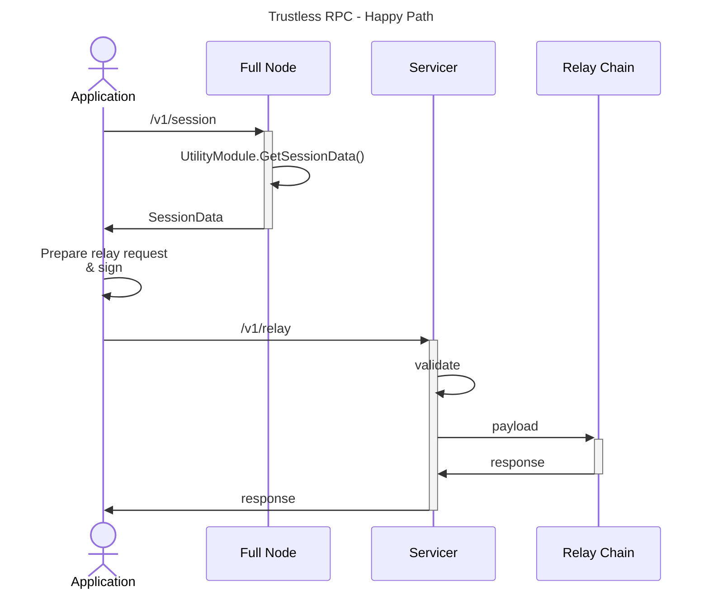

# Application Protocol

## Trustless Relay

```mermaid
sequenceDiagram
    actor A as Application
    participant FN as Full Node
    participant S as Servicer
    participant RC as Relay Chain

    title Trustless RPC - Happy Path

    A->>+FN: /v1/session
    FN->>FN: UtilityModule.GetSessionData()
    FN->>-A: SessionData

    A->>A: Prepare relay request<br>& sign

    A->>+S: /v1/relay
    S->>S: validate
    S->>+RC: payload
    RC->>-S: response
    S->>-A: response
```

## Application Balances

- Allow negative balances
